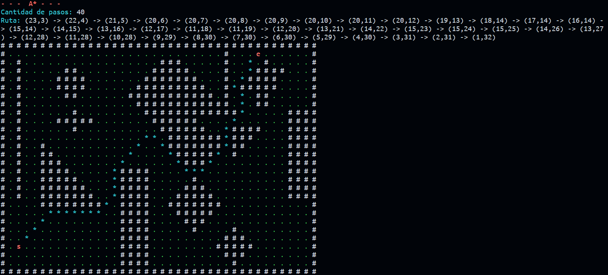

# Problema: Encontrar la ruta mínima entre dos puntos de un laberinto (A-Star)

Consiste en una implementación del problema del laberinto, utilizando el algoritmo
de A* para la clase de Inteligencia Artificial (IA).

## Ejemplo:

